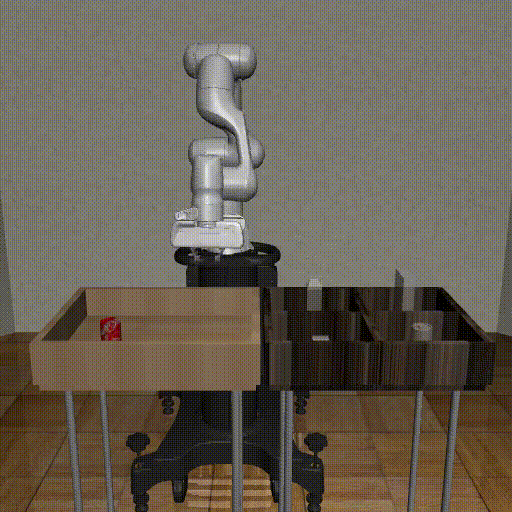

# robolfd

<p align="center">
  
</p>

**robolfd** is a python library for training agents from recorded expert demonstrations.

## Getting Started

### Installation

#### Developer installation
If you are interested in modifying the library, clone the repository and set up 
a development environment as follows

    git clone https://github.com/mohanksriram/robolfd.git
    pip install -e ".[dev]"

#### Standard Installation
##### Coming Soon...
<!--  
``robolfd`` requires Python 3.7+ library and [PyTorch (>= 1.7)](https://pytorch.org). 
To install the latest stable version, run
    pip install robolfd
-->

#### Usage
- Training an agent
```
python examples/offline/run_bc.py --train_iterations=5000 --max_episodes=20 --num_actors=10
--video_path=$your_video_path$ --cache_obs=False --batch_size=2048
```
- Evaluating a trained agent
```
python examples/offline/eval_bc.py --n_runs=5
```
